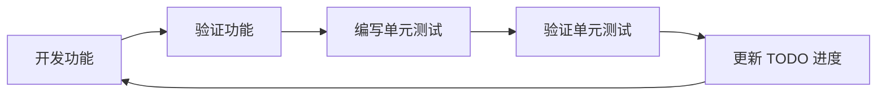

# 开发环境配置

## 环境设置

### 依赖管理
```bash
# 使用 uv 安装依赖
uv sync

# 安装开发依赖
uv sync --dev
```

### Python 要求
- **需要 Python 3.13+**（在 pyproject.toml 中指定）
- 全程使用现代 async/await 模式
- 所有新代码都需要类型注解

## 开发命令

### 测试
```bash
# 运行所有测试
uv run pytest

# 运行测试并生成覆盖率报告
uv run pytest --cov=openapi_mcp --cov-report=term-missing

# 运行特定测试文件
uv run pytest tests/test_server.py

# 运行测试并显示详细输出
uv run pytest -v
```

### 代码质量
```bash
# 使用 ruff 格式化代码
uv run ruff format .

# 使用 ruff 检查代码
uv run ruff check . --fix

# 使用 basedpyright 进行类型检查
uv run basedpyright
```

## 项目架构认知

### 核心组件
- **OpenApiMcpServer** (`openapi_mcp/server.py`): 与 FastAPI 应用集成的主要服务器类
- **OpenApiMcpConfig** (`openapi_mcp/config.py`): 基于 Pydantic 的配置模型
- **工具系统** (`openapi_mcp/tools/`): 9个内置 MCP 工具
- **安全层** (`openapi_mcp/security.py`): 工具过滤、数据脱敏、访问日志
- **传输处理器** (`openapi_mcp/transport.py`): 处理 MCP 协议通信
- **格式化器** (`openapi_mcp/formatters/`): 多种输出格式

### 要实现的的 MCP 模块

# Resources
- openapi://spec - 完整的 OpenAPI spec
- openapi://endpoints - 端点列表
- openapi://endpoints/{path} - 具体端点详情
- openapi://models - 数据模型列表
- openapi://models/{name} - 具体模型详情
- openapi://tags - 标签列表
- openapi://tags/{tag}/endpoints - 按标签分组的端点

# Tools
- search_endpoints - 复杂搜索和过滤
- generate_examples - 生成调用示例
- validate_requests - 请求验证

### 集成模式
```python
from fastapi import FastAPI
from openapi_mcp import OpenApiMcpServer, OpenApiMcpConfig

app = FastAPI(title="My API")
# ... 添加路由

config = OpenApiMcpConfig(cache_ttl=600, output_format='markdown')
mcp_server = OpenApiMcpServer(app, config)
mcp_server.mount('/mcp')  # 挂载支持 POST/GET/DELETE 的单一端点
```

## 开发注意事项

### 安全功能
- **工具过滤**: 路径模式、允许/禁止的标签、自定义过滤器函数
- **数据脱敏**: 自动脱敏响应中的敏感信息
- **访问日志**: 可配置的日志记录，可选数据脱敏
- **CORS 支持**: 为基于 Web 的 MCP 客户端配置允许的来源

### 测试结构
- `tests/` 中每个组件的单元测试
- 完整 MCP 工作流的集成测试
- FastAPI 应用的测试夹具
- pyproject.toml 中配置的覆盖率目标：>80%

### 错误处理模式
- 使用 Pydantic 进行数据验证
- 统一的异常处理机制
- 详细的错误日志记录
- 优雅的错误响应格式

## 开发工作流程

### 标准开发流程

每个功能模块都应该遵循以下迭代循环：



### 具体步骤

1. **开发功能**
   - 根据验收标准实现功能
   - 遵循代码规范和最佳实践
   - 添加必要的类型注解和文档字符串

2. **验证功能**
   - 运行手动测试确保功能正常工作
   - 检查边界情况和错误处理
   - 验证与现有功能的兼容性

3. **编写单元测试**
   - 创建对应的测试文件
   - 编写全面的测试用例
   - 包含正常情况、边界情况和异常情况

4. **验证单元测试**
   - 运行测试确保所有用例通过
   - 检查测试覆盖率是否达标
   - 运行完整的质量检查流程

5. **更新 TODO 进度**
   - 在 TODO.md 中标记已完成的任务
   - 更新进度计数
   - 创建有意义的 Git commit

### 每个步骤的验收标准

#### 功能开发验收标准
- [ ] 功能实现符合 TODO.md 中的要求
- [ ] 代码风格符合项目规范
- [ ] 类型注解完整且正确
- [ ] 错误处理机制完善
- [ ] 文档字符串清晰准确

#### 功能验证验收标准
- [ ] 功能在正常情况下正常工作
- [ ] 边界情况处理正确
- [ ] 错误情况有合理的反馈
- [ ] 与现有功能无冲突
- [ ] 性能表现符合预期

#### 单元测试验收标准
- [ ] 测试文件位置正确（`tests/` 目录下对应结构）
- [ ] 测试覆盖所有主要功能路径
- [ ] 包含正常、边界和异常情况的测试
- [ ] 测试用例命名清晰且有意义
- [ ] 使用合适的测试夹具和 mock

#### 测试验证验收标准
- [ ] 所有测试用例通过
- [ ] 测试覆盖率达到 85% 以上
- [ ] 代码质量检查通过（ruff, basedpyright）
- [ ] 性能测试通过（如果适用）
- [ ] 集成测试通过（如果需要）

### 质量检查命令

每个功能完成前必须运行：

```bash
# 1. 代码格式化
uv run ruff format .

# 2. 代码检查
uv run ruff check . --fix

# 3. 类型检查
uv run basedpyright

# 4. 运行测试
uv run pytest

# 5. 检查覆盖率
uv run pytest --cov=openapi_mcp --cov-report=term-missing

# 6. 运行所有质量检查
uv run pytest && uv run basedpyright && uv run ruff check .
```

### Git 提交规范

每个功能完成后，创建语义化的 commit：

```bash
# 格式：<类型>(<范围>): <描述>
feat(server): 添加 Resources 基础支持
fix(tools): 修复端点搜索的性能问题
test(resources): 添加 OpenAPI Spec 资源测试
refactor(security): 重构数据脱敏逻辑
docs(readme): 更新安装和使用说明
```

### 开发注意事项

1. **渐进式开发**：每次只专注一个小的功能点，避免一次性实现过多功能
2. **测试驱动**：先写测试用例，再实现功能，确保代码质量
3. **持续集成**：每完成一个功能就运行完整的质量检查
4. **文档同步**：功能变更时及时更新相关文档
5. **性能考虑**：实现功能时考虑性能影响，必要时进行优化