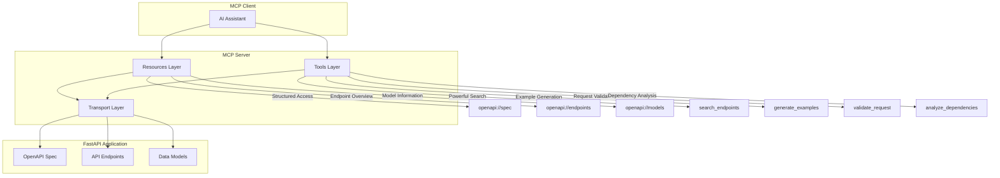
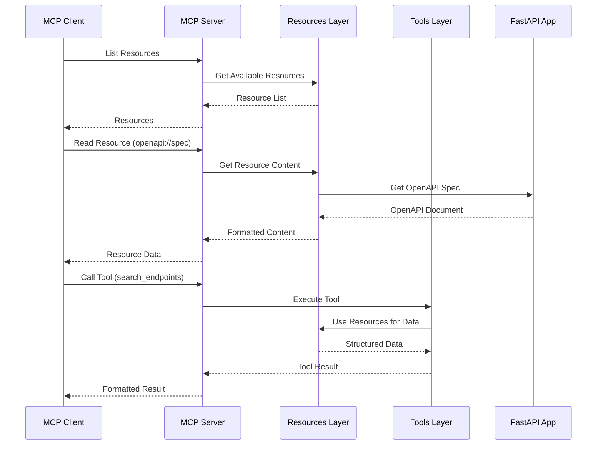

# FastAPI OpenAPI MCP Server

> 🚀 基于 MCP 2025-06-18 标准的 FastAPI OpenAPI Server，提供 Resources + Tools 混合架构，让 AI 编程助手能够高效查询和操作 API 信息，大幅减少 Token 消耗。

[](https://www.python.org/downloads/)
[](LICENSE)
[](https://github.com/astral-sh/ruff)
[](https://modelcontextprotocol.io/)

## 📖 项目简介

FastAPI OpenAPI MCP Server 是一个基于最新 MCP 2025-06-18 标准的服务器实现，采用创新的 **Resources + Tools 混合架构**，为 FastAPI 应用提供完整的 MCP 生态支持。该服务器让 AI 编程助手（如 Claude、GPT 等）能够：

- 🎯 **双重访问模式** - Resources 提供结构化概览，Tools 提供精确操作
- 📊 **智能缓存** - 多级缓存机制，显著提升响应速度
- 🔍 **强大搜索** - 支持正则表达式、模糊匹配、多维度搜索
- 🛡️ **安全可控** - 细粒度权限控制、数据脱敏、审计日志
- 💰 **极致优化** - 减少 90%+ 的 Token 消耗

### 适用场景

- ✅ 大型 API 项目（接口数量 > 50 个）
- ✅ 需要深度 AI 辅助开发和调试
- ✅ 严格的安全和合规要求
- ✅ 需要高性能和高可用性
- ✅ 多服务、多租户环境

## ✨ 核心功能

### 🌐 MCP Resources

基于最新 MCP 标准的 Resources 功能，提供直观的资源访问：

```
openapi://spec                 # 完整 OpenAPI 规范
openapi://endpoints           # 所有端点列表
openapi://endpoints/{path}    # 具体端点详情
openapi://models              # 数据模型列表
openapi://models/{name}       # 具体模型定义
openapi://tags                # 标签列表
openapi://tags/{tag}/endpoints # 按标签分组的端点
```

### 🔧 MCP Tools

4 个核心工具，覆盖所有使用场景：

1. **search_endpoints** - 强大的端点搜索和过滤
2. **generate_examples** - 智能调用示例生成
3. **validate_request** - 请求参数验证
4. **analyze_dependencies** - API 依赖关系分析

### 📡 访问方式

- ✅ **JSON-RPC 2.0** - 标准 MCP 协议
- ✅ **HTTP Transport** - 基于 HTTP 的 MCP 传输
- ✅ **SSE 流式传输** - 实时数据推送
- ✅ **多协议支持** - stdio、HTTP、WebSocket

## 🏗️ 架构设计

### 🎯 Resources + Tools 混合架构



**Resources 优势：**
- 📋 **结构化概览** - 提供完整的 API 结构视图
- 🎯 **直观导航** - 通过 URI 路径直接访问资源
- 💾 **高效缓存** - 资源级别的缓存机制
- 🔗 **关联访问** - 支持资源间的引用和跳转

**Tools 优势：**
- 🔍 **精确查询** - 复杂的搜索和过滤能力
- ⚡ **动态计算** - 实时数据分析和生成
- 🛠️ **业务逻辑** - 支持复杂的操作流程
- 🎨 **格式灵活** - 多种输出格式支持

### 📁 目录结构

```
openapi-mcp/
├── openapi_mcp/                 # 核心模块
│   ├── __init__.py
│   ├── server.py               # 核心 MCP Server
│   ├── config.py              # 配置管理
│   ├── transport.py           # 传输层实现
│   ├── resources/             # Resources 实现
│   │   ├── __init__.py
│   │   ├── base.py            # Resource 基类
│   │   ├── spec.py            # OpenAPI Spec Resource
│   │   ├── endpoints.py       # Endpoints Resources
│   │   ├── models.py          # Models Resources
│   │   └── tags.py            # Tags Resources
│   ├── tools/                 # Tools 实现
│   │   ├── __init__.py
│   │   ├── base.py            # Tool 基类
│   │   ├── search.py          # 搜索工具
│   │   ├── examples.py        # 示例生成工具
│   │   ├── validation.py      # 验证工具
│   │   └── analysis.py        # 分析工具
│   ├── security/              # 安全模块
│   │   ├── __init__.py
│   │   ├── filter.py          # 数据过滤
│   │   ├── audit.py           # 审计日志
│   │   └── auth.py            # 认证授权
│   ├── cache.py               # 缓存机制
│   ├── client.py              # MCP 客户端
│   └── types.py               # 类型定义
├── tests/                     # 测试文件
│   ├── test_resources/        # Resources 测试
│   ├── test_tools/            # Tools 测试
│   └── test_integration/      # 集成测试
├── examples/                  # 使用示例
│   ├── basic_usage.py         # 基础使用
│   ├── resources_tools_integration.py  # Resources + Tools 集成
│   ├── custom_config_example.py         # 自定义配置
│   ├── security_example.py              # 安全功能
│   ├── multi_app_example.py             # 多应用实例
│   ├── custom_tool_example.py           # 自定义工具
│   └── performance_test_example.py      # 性能测试
├── docs/                      # 文档
├── pyproject.toml
├── README.md
├── TODO.md
└── LICENSE
```

### 🧩 核心组件

#### 1. OpenApiMcpServer - 主服务器类

```python
class OpenApiMcpServer:
    """OpenAPI MCP Server 主类，实现 Resources + Tools 混合架构"""

    def __init__(
        self,
        fastapi_app: FastAPI,
        config: Optional[McpServerConfig] = None
    ):
        """
        初始化 MCP Server

        Args:
            fastapi_app: FastAPI 应用实例
            config: 服务器配置（可选）
        """

    def register_resource(self, resource: BaseResource) -> None:
        """注册 Resource"""

    def register_tool(self, tool: BaseTool) -> None:
        """注册 Tool"""

    def mount(self, path: str = "/mcp") -> None:
        """挂载 MCP 服务器到指定路径"""
```

#### 2. McpServerConfig - 配置管理

```python
@dataclass
class McpServerConfig:
    """MCP Server 完整配置"""

    # 服务器信息
    server_info: Dict[str, str] = field(default_factory=dict)

    # 缓存配置
    cache_enabled: bool = True
    cache_ttl: int = 300
    cache_size: int = 1000

    # 安全配置
    security_filter: Optional[SecurityFilter] = None
    access_log_enabled: bool = True
    audit_sensitive_operations: bool = True

    # 性能配置
    max_concurrent_requests: int = 50
    request_timeout: int = 30
    compression_enabled: bool = True
    metrics_enabled: bool = True

    # Resources 配置
    resources_config: Dict[str, Any] = field(default_factory=dict)

    # Tools 配置
    tools_config: Dict[str, Any] = field(default_factory=dict)
```

#### 3. BaseResource - Resource 基类

```python
class BaseResource(ABC):
    """Resource 基类"""

    @property
    @abstractmethod
    def uri(self) -> str:
        """Resource URI"""

    @property
    @abstractmethod
    def name(self) -> str:
        """Resource 名称"""

    @property
    @abstractmethod
    def description(self) -> str:
        """Resource 描述"""

    @abstractmethod
    async def get_content(self, params: Dict[str, Any]) -> str:
        """获取 Resource 内容"""
```

#### 4. BaseTool - Tool 基类

```python
class BaseTool(ABC):
    """Tool 基类"""

    @property
    @abstractmethod
    def name(self) -> str:
        """Tool 名称"""

    @property
    @abstractmethod
    def description(self) -> str:
        """Tool 描述"""

    @abstractmethod
    def get_definition(self) -> ToolDefinition:
        """获取 Tool 定义"""

    @abstractmethod
    async def execute(self, arguments: Dict[str, Any]) -> ToolResult:
        """执行 Tool"""
```

### 🔄 数据流架构



## 🚀 快速开始

### 安装

```bash
# 从 PyPI 安装（TODO: 发布后）
pip install fastapi-openapi-mcp

# 或使用 uv
uv add fastapi-openapi-mcp

# 开发模式安装
git clone https://github.com/yourusername/openapi-mcp.git
cd openapi-mcp
uv sync
```

### 💡 立即测试（使用 MCP Inspector）

在开发模式下，你可以立即使用 MCP Inspector 测试：

```bash
# 确保已安装依赖
uv sync

# 使用 MCP Inspector 测试 Resources + Tools
npx @modelcontextprotocol/inspector uv run python examples/mcp_stdio_example.py
```

这会打开一个 Web 界面（`http://localhost:5173`），让你可以：
- ✅ 查看所有 MCP Resources 和 Tools
- ✅ 浏览 OpenAPI 规范资源
- ✅ 交互式调用工具
- ✅ 实时查看返回结果

### 🎯 基础使用

```python
from fastapi import FastAPI
from openapi_mcp import OpenApiMcpServer

# 创建 FastAPI 应用
app = FastAPI(
    title="My Awesome API",
    version="1.0.0",
    description="一个展示 MCP 功能的示例 API"
)

# 添加你的路由
@app.get("/users", tags=["users"])
async def list_users():
    return {"users": []}

@app.post("/users", tags=["users"])
async def create_user(user_data: dict):
    return {"id": 1, "name": user_data.get("name"), "status": "created"}

# 集成 MCP Server（仅需 1 行代码）
mcp_server = OpenApiMcpServer(app)
mcp_server.mount("/mcp")

# 启动应用
if __name__ == "__main__":
    import uvicorn
    uvicorn.run(app, host="0.0.0.0", port=8000)
```

### 🔧 自定义配置

```python
from openapi_mcp import OpenApiMcpServer, McpServerConfig

# 自定义配置
config = McpServerConfig(
    server_info={
        "name": "My Custom MCP Server",
        "version": "2.0.0"
    },
    cache_enabled=True,
    cache_ttl=600,  # 10分钟缓存
    max_concurrent_requests=100,
    compression_enabled=True,
    metrics_enabled=True
)

mcp_server = OpenApiMcpServer(app, config=config)
mcp_server.mount("/mcp")
```

### 🛡️ 安全配置

```python
from openapi_mcp.security import SecurityFilter

class CustomSecurityFilter(SecurityFilter):
    def filter_data(self, data: Any, context: str = "") -> Any:
        """自定义数据脱敏"""
        if isinstance(data, dict):
            # 脱敏敏感字段
            sensitive_keys = ["password", "api_key", "secret"]
            for key in sensitive_keys:
                if key in data:
                    data[key] = "***"
        return data

# 启用安全功能
config = McpServerConfig(
    security_filter=CustomSecurityFilter(),
    access_log_enabled=True,
    audit_sensitive_operations=True
)

mcp_server = OpenApiMcpServer(app, config=config)
mcp_server.mount("/mcp")
```

### 🧪 Resources + Tools 集成使用

```python
import asyncio
from openapi_mcp.client import OpenApiMcpClient
from openapi_mcp.transport.http import HttpMcpTransport

async def demo_mixed_usage():
    """演示 Resources + Tools 混合使用"""

    # 连接到 MCP 服务器
    transport = HttpMcpTransport("http://localhost:8000/mcp")
    client = OpenApiMcpClient(transport)
    await transport.connect()

    try:
        # 1. 使用 Resources 获取概览
        resources = await client.list_resources()
        print(f"发现 {len(resources)} 个资源")

        # 2. 读取 OpenAPI 规范
        spec_content = await client.read_resource("openapi://spec")
        spec = json.loads(spec_content)
        print(f"API 标题: {spec['info']['title']}")

        # 3. 读取端点列表
        endpoints_content = await client.read_resource("openapi://endpoints")
        endpoints = json.loads(endpoints_content)
        print(f"总端点数: {len(endpoints)}")

        # 4. 使用 Tools 进行搜索
        search_result = await client.call_tool("search_endpoints", {
            "query": "user",
            "filters": {"methods": ["GET", "POST"]}
        })
        print(f"找到 {len(search_result['results'])} 个用户相关端点")

        # 5. 生成调用示例
        example_result = await client.call_tool("generate_examples", {
            "endpoint_path": "/users",
            "method": "POST",
            "formats": ["json", "curl"]
        })
        print("生成的示例:")
        print(example_result['examples']['json'])

    finally:
        await transport.disconnect()

# 运行演示
asyncio.run(demo_mixed_usage())
```

## 🔧 高级功能

### 🏎️ 性能优化

```python
# 高性能配置
config = McpServerConfig(
    # 缓存优化
    cache_enabled=True,
    cache_ttl=1800,              # 30分钟缓存
    cache_size=1000,             # 最大缓存条目

    # 并发控制
    max_concurrent_requests=100,
    request_timeout=60,

    # 传输优化
    compression_enabled=True,

    # 指标监控
    metrics_enabled=True
)
```

### 🔀 多应用管理

```python
from openapi_mcp import MultiAppManager

# 创建应用管理器
manager = MultiAppManager()

# 注册多个应用
manager.register_app("ecommerce", ecommerce_app)
manager.register_app("users", user_service_app)
manager.register_app("content", content_service_app)

# 统一挂载
manager.mount_all("/mcp")

# 应用信息
app_info = manager.get_app_info()
print(f"总应用数: {len(app_info)}")
```

### 🛠️ 自定义 Tools

```python
from openapi_mcp.tools.base import BaseTool
from openapi_mcp.types import ToolDefinition, ToolResult

class ApiAnalyzerTool(BaseTool):
    """自定义 API 分析工具"""

    def __init__(self):
        super().__init__()
        self.name = "api_analyzer"
        self.description = "分析 OpenAPI 规范，提供统计信息"

    def get_definition(self) -> ToolDefinition:
        return ToolDefinition(
            name=self.name,
            description=self.description,
            input_schema={
                "type": "object",
                "properties": {
                    "analysis_type": {
                        "type": "string",
                        "enum": ["overview", "endpoints", "models"],
                        "default": "overview"
                    }
                }
            }
        )

    async def execute(self, arguments: Dict[str, Any]) -> ToolResult:
        # 获取 OpenAPI 规范
        spec = await self.get_openapi_spec()

        # 执行分析逻辑
        analysis_type = arguments.get("analysis_type", "overview")
        result = self._analyze_spec(spec, analysis_type)

        return ToolResult(
            success=True,
            data=result,
            message="API 分析完成"
        )

    def _analyze_spec(self, spec: Dict, analysis_type: str) -> Dict:
        # 实现具体的分析逻辑
        paths = spec.get("paths", {})
        return {
            "total_paths": len(paths),
            "total_endpoints": sum(len(methods) for methods in paths.values())
        }

# 注册自定义工具
mcp_server.register_tool(ApiAnalyzerTool())
```

### 🔧 自定义 Resources

```python
from openapi_mcp.resources.base import BaseResource

class CustomAnalyticsResource(BaseResource):
    """自定义分析资源"""

    @property
    def uri(self) -> str:
        return "openapi://analytics"

    @property
    def name(self) -> str:
        return "API Analytics"

    @property
    def description(self) -> str:
        return "API 使用分析和统计信息"

    async def get_content(self, params: Dict[str, Any]) -> str:
        # 获取分析数据
        spec = await self.get_openapi_spec()

        analytics = {
            "endpoint_count": len(spec.get("paths", {})),
            "tag_distribution": self._analyze_tags(spec),
            "method_distribution": self._analyze_methods(spec)
        }

        return json.dumps(analytics, indent=2)

# 注册自定义资源
mcp_server.register_resource(CustomAnalyticsResource())
```

### 🔐 安全增强

```python
from openapi_mcp.security import SecurityFilter, AuditLogger

class EnterpriseSecurityFilter(SecurityFilter):
    """企业级安全过滤器"""

    def filter_tool(self, tool_name: str, tool_info: Dict) -> bool:
        # 禁用危险工具
        dangerous_tools = ['delete_endpoint', 'modify_server_config']
        return tool_name not in dangerous_tools

    def filter_data(self, data: Any, context: str = "") -> Any:
        # 多层脱敏逻辑
        if isinstance(data, dict):
            return self._apply_enterprise_filtering(data)
        return data

    def _apply_enterprise_filtering(self, data: Dict) -> Dict:
        # 实现企业级数据过滤逻辑
        filtered = data.copy()

        # 移除敏感字段
        sensitive_fields = ['password', 'secret', 'token', 'key']
        for field in sensitive_fields:
            if field in filtered:
                filtered[field] = '[REDACTED]'

        return filtered

# 启用企业级安全
config = McpServerConfig(
    security_filter=EnterpriseSecurityFilter(),
    access_log_enabled=True,
    audit_sensitive_operations=True
)
```

## 📚 API 参考

### 🌐 MCP Resources 详解

#### 1. OpenAPI Spec Resource

- **URI**: `openapi://spec`
- **描述**: 返回完整的 OpenAPI 规范文档
- **用途**: 获取 API 的完整结构信息

```bash
# 读取完整规范
GET openapi://spec
```

#### 2. Endpoints Resources

- **URI**: `openapi://endpoints`
- **描述**: 返回所有端点的概要信息
- **用途**: 快速浏览 API 端点

```bash
# 获取所有端点
GET openapi://endpoints

# 获取特定端点
GET openapi://endpoints/users/{user_id}
```

#### 3. Models Resources

- **URI**: `openapi://models`
- **描述**: 返回数据模型信息
- **用途**: 了解数据结构

```bash
# 获取所有模型
GET openapi://models

# 获取特定模型
GET openapi://models/User
```

#### 4. Tags Resources

- **URI**: `openapi://tags`
- **描述**: 返回标签分组信息
- **用途**: 按功能模块浏览 API

```bash
# 获取所有标签
GET openapi://tags

# 获取标签下的端点
GET openapi://tags/users/endpoints
```

### 🔧 MCP Tools 详解

#### 1. search_endpoints

**功能**: 强大的端点搜索和过滤

```python
# 基本搜索
result = await client.call_tool("search_endpoints", {
    "query": "user"
})

# 高级搜索
result = await client.call_tool("search_endpoints", {
    "query": "create user",
    "filters": {
        "methods": ["POST"],
        "tags": ["users"]
    },
    "pattern": r".*users.*"
})
```

**参数**:
- `query` (string): 搜索关键词
- `filters` (object): 过滤条件
  - `methods` (array): HTTP 方法
  - `tags` (array): 标签
- `pattern` (string): 正则表达式模式

#### 2. generate_examples

**功能**: 智能生成调用示例

```python
# 生成基础示例
result = await client.call_tool("generate_examples", {
    "endpoint_path": "/users",
    "method": "POST",
    "formats": ["json", "curl", "python"]
})

# 生成带参数的示例
result = await client.call_tool("generate_examples", {
    "endpoint_path": "/users/{user_id}",
    "method": "GET",
    "include_parameters": True,
    "example_values": {
        "user_id": 123
    }
})
```

**参数**:
- `endpoint_path` (string): 端点路径
- `method` (string): HTTP 方法
- `formats` (array): 输出格式
- `include_parameters` (boolean): 是否包含参数示例
- `example_values` (object): 自定义示例值

#### 3. validate_request

**功能**: 请求参数验证

```python
# 验证请求数据
result = await client.call_tool("validate_request", {
    "endpoint_path": "/users",
    "method": "POST",
    "request_data": {
        "name": "John Doe",
        "email": "john@example.com"
    }
})
```

#### 4. analyze_dependencies

**功能**: API 依赖关系分析

```python
# 分析端点依赖
result = await client.call_tool("analyze_dependencies", {
    "endpoint_path": "/orders/{order_id}",
    "include_transitive": True
})
```

### 📊 性能指标

#### 缓存性能

```python
# 获取缓存统计
cache_stats = mcp_server.get_cache_stats()
print(f"缓存命中率: {cache_stats['hit_rate']:.2%}")
print(f"缓存大小: {cache_stats['size']}")
```

#### 系统性能

```python
# 获取性能指标
metrics = mcp_server.get_metrics()
print(f"请求总数: {metrics['total_requests']}")
print(f"平均响应时间: {metrics['avg_response_time']}ms")
print(f"错误率: {metrics['error_rate']:.2%}")
```

## 🤝 贡献指南

我们欢迎各种形式的贡献！

### 开发环境搭建

```bash
# 克隆项目
git clone https://github.com/yourusername/openapi-mcp-server.git
cd openapi-mcp-server

# 安装依赖
uv sync

# 运行测试
uv run pytest

# 代码格式化
uv run ruff format .

# 代码检查
uv run ruff check . --fix

# 类型检查
uv run basedpyright
```

### 提交规范

遵循 [Conventional Commits](https://www.conventionalcommits.org/) 规范：

```
feat: 添加新功能
fix: 修复 bug
docs: 文档更新
style: 代码格式调整
refactor: 代码重构
test: 测试相关
chore: 构建或工具更新
```

## 📄 许可证

[MIT License](LICENSE)

## 🙏 致谢

- [FastAPI](https://fastapi.tiangolo.com/) - 现代化的 Python Web 框架
- [MCP](https://modelcontextprotocol.io/) - Model Context Protocol
- [Anthropic](https://www.anthropic.com/) - MCP 协议的创建者

## 📮 联系方式

- 问题反馈: [GitHub Issues](https://github.com/yourusername/openapi-mcp-server/issues)
- 功能建议: [GitHub Discussions](https://github.com/yourusername/openapi-mcp-server/discussions)

---

**注**: 本项目当前处于开发阶段，API 可能会有变动。欢迎提前试用并提供反馈！
